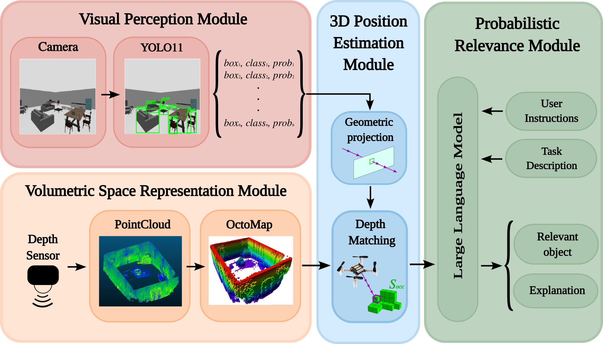

# Spatial-Semantic Reasoning using Large Language Models for Efficient UAV Search Operations

**Author:** Marin Maletić<br>
**Date:** February 2025<br>
**Last Updated:** July 2025<br>

This code accompanies the work in the ECMR 2025 paper "Spatial-Semantic Reasoning using Large Language Models for Efficient UAV Search Operations".
If you find the work here useful in you own research, please cite the paper:

## Motivation

The original idea was developed as a part of the Master's degree work titled **"Control of an Unmanned Aerial Vehicle for Object Detection in 3D Space Based on Spatial Semantics"** at Faculty of electrical engineering and computing, University of Zagreb.

The task was to create, present and implement a method of using *Large Language Models (LLM)* to reduce the time necessary to find the target object in a 3D space. YOLO11 Object Detection and OctoMap are used to map detected objects and its 3D coordinates while LLM uses that information to create an understanding of the UAV and the space around it. The LLM then guides the search to a more logical direction than a random search.



This repository contains all developed algorithms, code and the documentation.

**Keywords:** <br>
Unmanned aerial vehicle; YOLO; Autonomous search; Space semantics;
LLM; Crazyflie; 3D navigation, Computer vision; LiDAR

**Used Technologies:** <br>
Crazyflie 2.1; OptiTrack; Livox MID-360 LiDAR; Cartographer SLAM; CloudCompare; OctoMap; A* search algorithm; Polinomial splines; YOLOv8; LLM; Python; OpenCV; Docker

**This code was tested in Docker containers provided by [LARICS](https://github.com/larics)**

- [CrazySim for simulation testing](https://github.com/larics/docker_files/tree/master/ros2/ros2-humble/crazyflies-sitl)
- [CrazySwarm for real world experiments](https://github.com/larics/docker_files/tree/master/ros2/ros2-jazzy/crazyflies)

## Prerequisites

- Ubuntu 22.04
- ROS 2 (Humble & Iron)
- Python 3.10
- [CrazySwarm](https://crazyswarm.readthedocs.io/en/latest/) and [CrazySim](https://github.com/gtfactslab/CrazySim) package
- Octomap of the space in .bt file format

Clone the repository:

```bash
git clone https://github.com/larics/UAV-LLM-semantic-reasoning.git
cd UAV-LLM-semantic-reasoning
```

Other dependencies can be installed with:

```bash
pip install -r requirements.txt
```
Install OctoMap for Python:

```bash
apt-get install libqt5opengl5-dev libqt5svg5-dev cmake 
sudo apt-get install libdynamicedt3d-dev
pip install trimesh==3.8.11
pip install cython==0.29.25
pip install setuptools==58.0.0
pip install --upgrade "numpy>=1.17.3,<1.25.0"
CXXFLAGS="-std=c++11" pip install octomap-python==1.8.0.post11
export LD_LIBRARY_PATH=/usr/local/lib:$LD_LIBRARY_PATH
```

## Installation & Running

The repository is to be clonned as it is outside of the CrazySim (simulation) or CrazySwarm (real world) packages. 
ROS2 workspace and ROS2 should be sourced before running the code. 
Models and the sdf file used in the simulation can be downloaded [here](https://drive.google.com/file/d/15_DUEFOr0VFzXhRMFV648gFY7OKM_s3a/view?usp=sharing).

A bash script that runs Tmuxinator with needed terminals is provided:

#### Simulation

```bash
cd run_simulation
./start_tmux.sh
```

#### Real World

```bash
cd run_realworld
./start_tmux.sh
```

### Before running the code:

- Add *yolo_ros_msgs* folder to *ros2_ws/src* folder and compile the ROS2 workspace again
- Your ChatGPT API key needs to be added in */config/chatgpt_credentials.yaml* file
- Change topic names according to Crazyflie name
- Copy Rviz configuration *config/config.rviz* to *ros2_ws/src/crazyswarm2/crazyflie/config*
- Comment out rclpy.init() in crazyswarm_py.py script in *crazyswarm2/crazyflie_py/crazyflie_py* folder
- Add the camera sensor to the crazyflie model in the simulation

**Adding a camera to the crazyflie model:**
1. Add the camera plugin to */root/CrazySim/crazyflie-firmware/tools/crazyflie-simulation/simulator_files/gazebo/models/crazyflie/model.sdf.jinja*, under the IMU sensor at line 52:

```bash
    <sensor name="camera_sensor" type="camera"> 
        <camera>
            <horizontal_fov>1.5184</horizontal_fov>
            <image>
                <width>324</width>
                <height>324</height>
            </image>
            <clip>
                <near>0.1</near>
                <far>100</far>
            </clip>
        </camera>
        <always_on>1</always_on>
        <update_rate>30</update_rate>
        <visualize>true</visualize>
        <topic>/cf_{{ cf_id }}/camera</topic>
    </sensor>
```

2. Copy *gz_bridge.yaml* from the config folder to *ros2_ws/src/crazyswarm2/crazyflie/config*
3. Add the bridge node to *parse_yaml* function in *ros2_ws/src/crazyswarm2/crazyflie/launch/launch.py*:

```bash
gz_bridge_yaml = os.path.join(
        get_package_share_directory('crazyflie'),
        'config',
        'gz_bridge.yaml')
 
# Append the bridge node to the return value
        Node(
            package='ros_gz_bridge',
            executable='parameter_bridge',
            output='screen',
            parameters = [{'config_file': gz_bridge_yaml}]
            )
```

## Results
Video results of the simulation and realworld testing of different scenarios can be found in the __documentation folder__. Below is one example of the algorithm working where the task is to find a **computer mouse**:

[](https://youtu.be/_r-umRlyUrg)

In the terminal in the lower part of the screen, informations about the search are displayed. 

The initial scan sees a computer monitor but no mouse, so LLM concludes that the computer mouse could be close to the monitor. Then it conducts a search around it which results with the computer mouse being found.

## Future work

- Research the possibilities of VLMs
- More diverse testing and benchmark results
