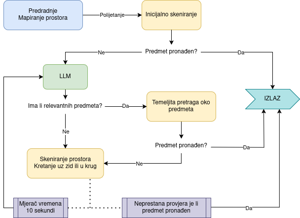

# UAV-control-using-semantics-and-LLM

**Author:** Marin Maletić<br>
**Date:** February 2025.<br>

## Motivation

The work presented here was done as a part of the Master's degree work titled **"Control of an Unmanned Aerial Vehicle for Object Detection in 3D Space Based on Spatial Semantics"** at Faculty of electrical engineering and computing, University of Zagreb.

The task was to create, present and implement a method of using *Large Language Models (LLM)* to reduce the time necessary to find the target object in a 3D space. YOLOv8 Object Detection and OctoMap are used to map detected objects and its 3D coordinates while LLM uses that information to create an understanding of the UAV and the space around it. The LLM then guides the search to a more logical direction than a random search.



This repository contains all developed algorithms, code and the documentation.

**Keywords:** <br>
Unmanned aerial vehicle; YOLO; Autonomous search; Space semantics;
LLM; Crazyflie; 3D navigation, Computer vision; LiDAR

**Used Technologies:** <br>
Crazyflie 2.1; OptiTrack; Livox MID-360 LiDAR; Cartographer SLAM; CloudCompare; OctoMap; A* search algorithm; Polinomial splines; YOLOv8; LLM; Python; OpenCV; Docker

**This code was tested in Docker containers provided by [LARICS](https://github.com/larics)**

- [CrazySim for simulation testing](https://github.com/larics/docker_files/tree/master/ros2/ros2-humble/crazyflies)
- [CrazySwarm for real world experiments](https://github.com/larics/docker_files/tree/master/ros2/ros2-iron/crazyflies-real-world)

## Prerequisites

- Ubuntu 22.04
- ROS 2 (Humble & Iron)
- Python 3.10
- [CrazySwarm](https://crazyswarm.readthedocs.io/en/latest/) and [CrazySim](https://github.com/gtfactslab/CrazySim) package
- Octomap of the space in .bt file format

Other dependencies can be installed with:

```bash
cd UAV-control-using-semantics-and-LLM
pip install -r requirements.txt
```
Install OctoMap for Python:

```bash
apt-get install libqt5opengl5-dev libqt5svg5-dev cmake
sudo apt-get install libdynamicedt3d-dev
CXXFLAGS="-std=c++11" pip install octomap-python==1.8.0.post11
export LD_LIBRARY_PATH=/usr/local/lib:$LD_LIBRARY_PATH
```

## Installation & Running

The repository is to be clonned as it is outside of the CrazySim (simulation) or CrazySwarm (real world) packages. ROS2 workspace and ROS2 should be sourced before running the code. A bash script that runs Tmuxinator with needed terminals is provided:

#### Simulation

```bash
cd run_simulation
./start_tmux.sh
```

#### Real World

```bash
cd run_realworld
./start_tmux.sh
```

**Before running the code:**

- Add yolo_ros_msgs folder to interfaces and compile the ROS2 workspace again
- ChatGPT API key needs to be added in LLM_tools.py script
- Change topic names according to Crazyflie name